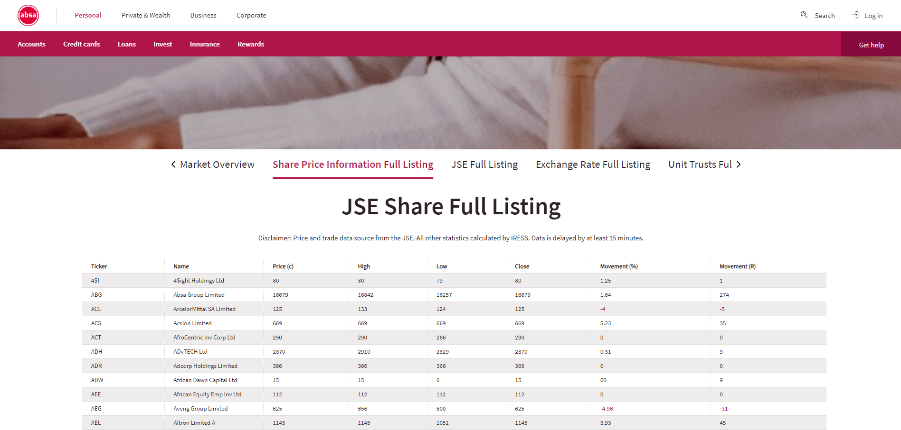
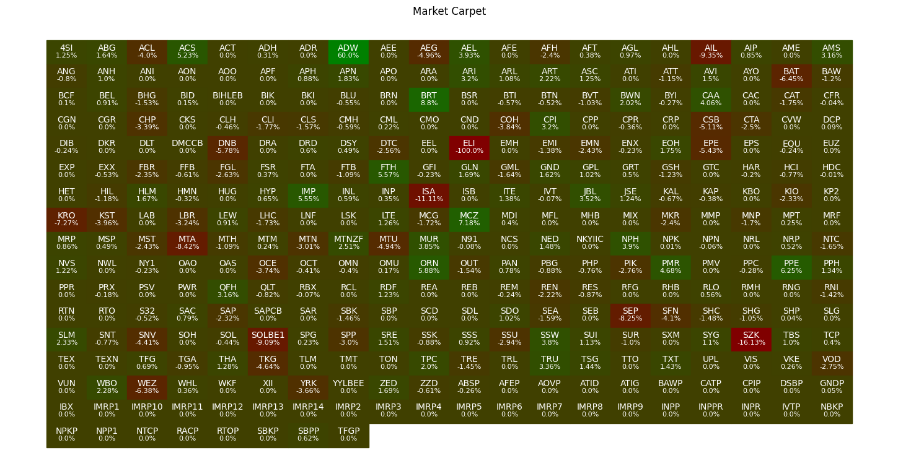
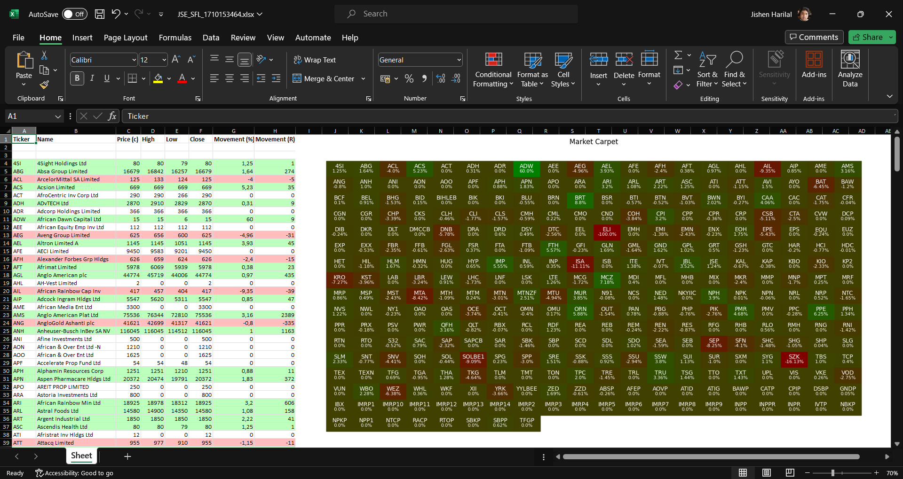

# 📈JSE Stock Visualiser
[](https://www.python.org/downloads/)
[](https://pypi.org/project/beautifulsoup4/)
[](https://pypi.org/project/requests/)
[](https://pypi.org/project/matplotlib/)
[](https://pypi.org/project/openpyxl/)
[](https://opensource.org/licenses/MIT)

## Overview

The JSE Stock Visualiser is a Python script designed to automate the retrieval, processing, and visualisation of real-time stock data from the ABSA webpage for Johannesburg Stock Exchange (JSE) stocks.
The script leverages web scraping, Matplotlib for data visualisation, and OpenPyXL for Excel export functionality.

## Features

- **Web Scraping:** The script scrapes relevant stock information from the ABSA webpage, including ticker symbols, stock names, prices, highs, lows, closes, movement percentages, and movement in ZAR from over 300 stocks.  
   
- **Data Visualisation:** Utilizes Matplotlib to create a 'Market Carpet' visualisation, representing stock movements with colored rectangles for each stock.  
  
- **Excel Export:** Generates an Excel workbook using OpenPyXL, exporting the scraped stock data along with the visualisation for further analysis and reporting.  
  

## Getting Started

### Prerequisites

- Python 3.11
- Required Python packages: `matplotlib`, `beautifulsoup4`, `openpyxl`, `requests`

### Installation

1. Clone the repository:

   ```bash
   git clone https://github.com/MrMatrix2108/jse-stock-visualiser.git
   ```

2. Install required packages:

   ```bash
   pip install -r requirements.txt
   ```

### Usage

1. Run the script:

   ```bash
   python JSE_StockVisualiser.py
   ```

2. The script will scrape data, generate the 'Market Carpet' visualisation, and save the results in an Excel workbook e.g.`JSE_SFL_1710153464.xlsx`.

### Configuration

- Adjust the script as needed by modifying constants or adding new features to suit your requirements.

## Contributing

Contributions are welcome! If you have any ideas for improvements or bug fixes, please open an issue or submit a pull request.

## ©️License

This project is licensed under the [MIT License](LICENSE).

## Acknowledgments

- Special thanks to ABSA for providing the stock data on their [webpage](https://www.absa.co.za/indices/share-information/).

---
